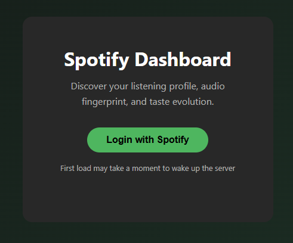
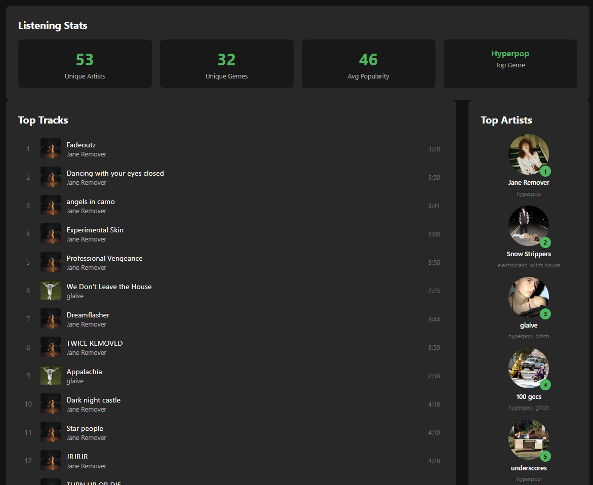

# Spotify Dashboard

A personal Spotify analytics dashboard that showcases your top tracks and artists, genre and popularity breakdowns, and listening stats — all filterable by time period.

## Screenshots






## Architecture

- **Frontend**: React + TypeScript + Vite, Recharts for data visualization
- **Backend**: Python FastAPI, httpx for Spotify API calls
- **Database**: MongoDB (motor async driver) for listening history snapshots
- **Auth**: Spotify OAuth 2.0 (authorization code flow, server-side token exchange)
- **Deployment**: Netlify (frontend) + Render (backend)

## Features

- **Listening Stats** — Unique artists, genres, average popularity, and top genre at a glance
- **Top Tracks & Artists** — View your most listened-to tracks and artists across three time ranges (4 weeks, 6 months, all time)
- **Genre Breakdown** — Horizontal bar chart of your top 10 genres
- **Popularity Distribution** — Histogram showing how mainstream (or niche) your taste is

## Live Demo

> **Note:** This app uses Spotify's API in development mode, which limits access to pre-approved accounts only. If you'd like to try it with your own Spotify account, reach out and I can add you. Otherwise, check out the screenshots above for a full walkthrough.

## Setup

### Prerequisites

- Node.js 18+
- Python 3.11+
- MongoDB (local or Atlas)
- Spotify Developer App (create one at [developer.spotify.com](https://developer.spotify.com/dashboard))

### Backend

```bash
cd backend
python -m venv .venv
source .venv/bin/activate  # Windows: .venv\Scripts\activate
pip install -r requirements.txt
cp .env.example .env
# Edit .env with your Spotify client ID/secret
uvicorn main:app --reload
```

### Frontend

```bash
cd frontend
npm install
cp .env.example .env.local
# Edit .env.local with your Spotify client ID
npm run dev
```

### Spotify App Configuration

1. Go to your [Spotify Developer Dashboard](https://developer.spotify.com/dashboard)
2. Create an app or select an existing one
3. Add `http://localhost:5173/callback` as a Redirect URI
4. Copy the Client ID and Client Secret to your `.env` files

## Project Structure

```
backend/
  main.py              # FastAPI app entry point
  config.py            # Environment configuration
  routers/             # API route handlers (auth, tracks, artists, profile)
  services/            # Spotify API client
  models/              # Pydantic schemas, database connection
  middleware/          # Auth token extraction
  db/                  # MongoDB repositories

frontend/
  src/
    api/               # Axios client + API call modules
    context/           # Auth context (login/logout/profile state)
    hooks/             # Data-fetching hooks (useTopTracks, useTopArtists, useAudioFeatures)
    pages/             # Login, Callback, Dashboard pages
    components/        # UI components (radar chart, track/artist lists, etc.)
    types/             # TypeScript interfaces
```
